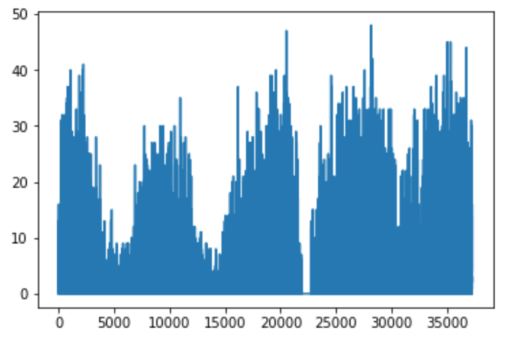

## Tutorial

#### Use datasets from UCTB

UCTB is designed for urban computing in various scenarios. Currently, It presets a public dataset about bikesharing. This dataset was collected from U.S. open data portals, including 49 million, 13 million, and 14 million historical flow records in [New York City](https://www.citibikenyc.com/system-data) (``NYC``), [Chicago](https://www.divvybikes.com/system-data) (``Chicago``) and [Washington, D.C](https://www.capitalbikeshare.com/system-data) (``DC``), respectively. Each record contains the start station, start time, stop station, stop time, etc. We predict the number of bikesharing demands in each station (i.e., the number of bike borrowers).

In the future version, we consider releasing more datasets covering other applications such as ridesharing, metro traffic flow, and electrical charging station usage. **If you are interested in this project, making a contribution to the dataset is strongly welcomed :)** 

To help better accuse dataset, UCTB provides data loader APIs ``UCTB.dataset.data_loader``, which can be used to preprocess data, including data division, normalization, and extract temporal and spatial knowledge. 

In the following tutorial, we illustrate how to use ``UCTB.dataset.data_loader`` APIs to inspect the bikesharing dataset.


```python
from UCTB.dataset.data_loader import NodeTrafficLoader
```

We use 10% (``data_range=0.1``) of the bike data in New York as an example. Firstly, let's initialize a ``NodeTrafficLoader`` object:


```python
data_loader = NodeTrafficLoader(data_range=0.1, dataset='Bike', city='NYC')
```

Take a look at the necessary information about the dataset:


```python
# Traffic data 
print('Data time range', data_loader.dataset.time_range)
print('Traffic data shape:', data_loader.traffic_data.shape)
# The first dimension of data_loader.traffic_data is the length of time-sequence.
# The second dimension is the number of stations.
print('Time fitness:', data_loader.dataset.time_fitness, 'minutes')
print('Time sequence length:', data_loader.traffic_data.shape[0])
print('Number of stations:', data_loader.traffic_data.shape[1])
```

    Data time range ['2013-07-01', '2017-09-30']
    Traffic data shape: (3724, 717)
    Time fitness: 60 minutes
    Time sequence length: 3724
    Number of stations: 717


Visualize the distribution of the traffic data:


```python
import matplotlib.pyplot as plt
plt.plot(data_loader.traffic_data[:, 0])
plt.show()
```





#### Build your own datasets

To make loader APIs compatible with your own data, you can store it in a ``dict`` variable with formats as follows.


```python
# Let's say ``my_dataset`` is your dataset.
my_dataset = {
    "TimeRange": ['YYYY-MM-DD', 'YYYY-MM-DD'],
    "TimeFitness": 60, # Minutes
    
    "Node": {
        "TrafficNode": np.array, # With shape [time, num-of-node]
        "TrafficMonthlyInteraction": np.array, # With shape [month, num-of-node. num-of-node]
        "StationInfo": {id: [build-time, # Could also be int
                             lat, lng, name]},
        "POI": []
    },

    "Grid": {
        "TrafficGrid": [],
        "GridLatLng": [],
        "POI": []
    },

    "ExternalFeature": {
         "Weather": [time, weather-feature-dim]
    }
}
```

And then save it with package ``pickle`` to a local path ``pkl_file_name``.


```python
import pickle
pkl_file_name = './my_dataset.pkl'  
with open(pkl_file_name, 'wb') as handle:
    pickle.dump(my_dataset, handle, protocol=pickle.HIGHEST_PROTOCOL)
```

Finally, you can make uses of your dataset by UCTB's loader APIs:


```python
data_loader = NodeTrafficLoader(dataset=pkl_file_name)
```

#### Use build-in models from UCTB

##### Use single temporal feature in regression

UCTB provides many classical and popular spatial-temporal predicting models. These models can be used to either predicting series for a single station or for all stations. You can find the concrete instruction in ``UCTB.model``.

The following example shows how to use a **Hidden Markov model** to handle a simple time series predicting problem. We will predict the the number of bikesharing demands ``test_y``(i.e., the number of bike borrowers) for a specific station ``target_node``. In this case, the model takes a few recent timesteps in the past as inputs and then predict the future.


```python
import numpy as np
import matplotlib.pyplot as plt

from UCTB.model import HMM
from UCTB.dataset import NodeTrafficLoader
from UCTB.evaluation import metric
```


```python
data_loader = NodeTrafficLoader(data_range=0.1, dataset='Bike', city='NYC',
                                closeness_len=12, period_len=0, trend_len=0,
                                test_ratio=0.2, normalize=False, with_lm=False, with_tpe=False)
```

Split the data into train and test set.


```python
target_node = 233
train_x, test_x = data_loader.train_closeness[:, target_node:target_node+1, -1, 0], data_loader.test_closeness[:, target_node, :, :]
test_y = data_loader.test_y[:, target_node, 0]
```

Inspect the shape of data.


```python
print(train_x.shape)
print(test_x.shape)
print(test_y.shape)
```

    (2967, 1)
    (745, 12, 1)
    (745,)


Build the model.


```python
model = HMM(num_components=8, n_iter=50)
```

Now, we can fit the model to the train dataset.


```python
model.fit(x=train_x)
```

    Status: converged


When the model is converged, we make predictions on test data.


```python
predictions = []
for t in range(test_x.shape[0]):
    p = np.squeeze(model.predict(x=test_x[t], length=1))
    predictions.append(p)
```

We can evaluate the performance of the model by build-in ``UCTB.evaluation`` APIs.


```python
test_rmse = metric.rmse(predictions, test_y, threshold=0)
test_rmse
```


    3.76137200105079

##### Use multiple temporal features in regression

In this case, let's take more temporal knowledge about ``target_node`` into account. Specifically, we will concatenate factors, including ``closeness``, ``period``, and ``trend``, and use **XGBoost** as the predicting model.


```python
import numpy as np
import matplotlib.pyplot as plt

from UCTB.model import XGBoost
from UCTB.dataset import NodeTrafficLoader
from UCTB.evaluation import metric

data_loader = NodeTrafficLoader(data_range=0.1, dataset='Bike', city='NYC',
                                closeness_len=6, period_len=7, trend_len=4,
                                test_ratio=0.2, normalize=False, with_lm=False, with_tpe=False)
target_node = 233
train_closeness = data_loader.train_closeness[:, target_node, :, 0]
train_period = data_loader.train_period[:, target_node, :, 0]
train_trend = data_loader.train_trend[:, target_node, :, 0]
train_y = data_loader.train_y[:, target_node, 0]

test_closeness = data_loader.test_closeness[:, target_node, :, 0]
test_period = data_loader.test_period[:, target_node, :, 0]
test_trend = data_loader.test_trend[:, target_node, :, 0]
test_y = data_loader.test_y[:, target_node, 0]

train_X = np.concatenate([train_closeness, train_period, train_trend], axis=-1)
test_X = np.concatenate([test_closeness, test_period, test_trend], axis=-1)

print(train_X.shape)
print(train_y.shape)
print(test_X.shape)
print(test_y.shape)

model = XGBoost(n_estimators=100, max_depth=3, objective='reg:linear')
model.fit(train_X, train_y)
predictions = model.predict(test_X)
print('Test RMSE', metric.rmse(predictions, test_y, threshold=0))
```

    Test RMSE 3.3267457

#### Build your own model using UCTB (Not yet finished)


------

<u>[Back To HomePage](../index.html)</u>

